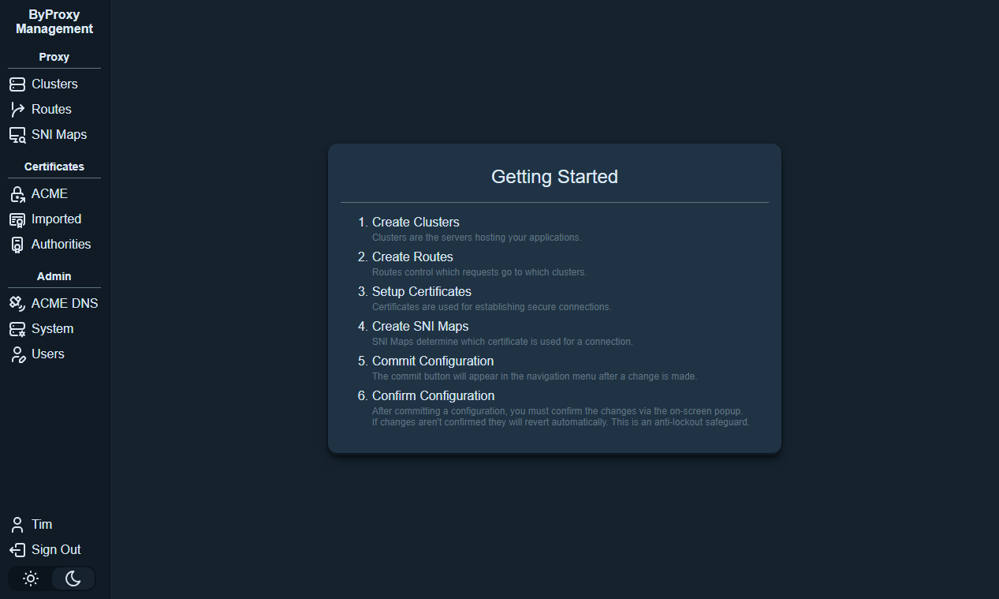
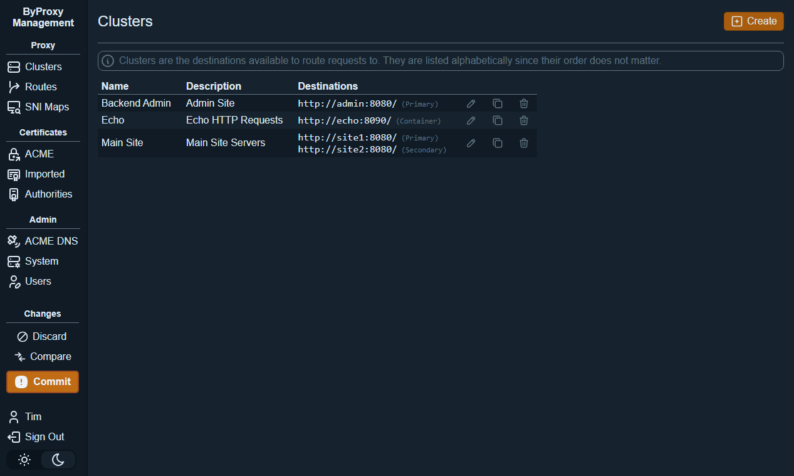
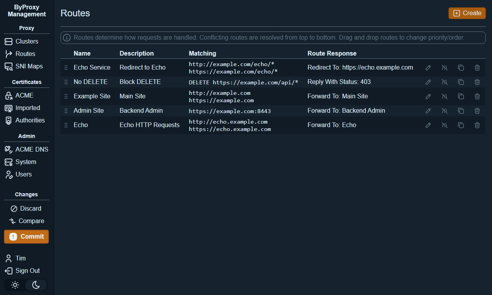
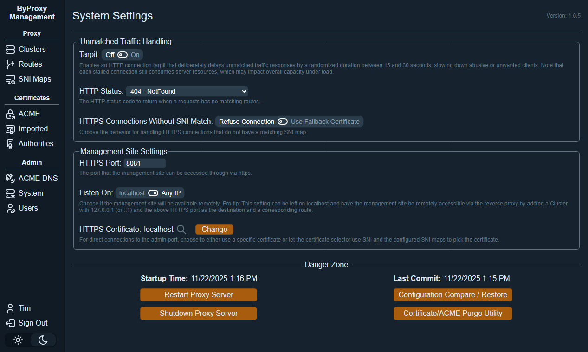

# ByProxy - Blazorized YARP Proxy

A reverse proxy built on top of **Microsoft YARP**.

ByProxy extends YARP’s core capabilities with certificate automation, advanced routing, and a full administrative web UI.

---

## Features

### Enhanced Routing & Control
- **Port-based filtering/routing**
- **Route outcomes:**
  - Forward to a cluster
  - Return an HTTP status
  - Issue an HTTP redirect
  - Tarpit when required
- **Optional HTTP → HTTPS redirection** (per-route)
- **Tarpit support** when no routes match

### Certificate Management
- **ACME support** using Let’s Encrypt (production & staging)
- **HTTP-01 and DNS-01 challenges**, including wildcard support
- **DNS-01 fulfilled through a custom C# script** executed from the Web UI
  - Script samples available in the [timconner/byproxy-dns-samples](https://github.com/timconner/ByProxy-DNS-Samples/) repository
- **Import existing certificates** or **issue certificates from internal CA(s)**

### Administration & Configuration
- **Full admin Web UI** built with hosted Blazor Server
- **Commit/confirm model for configuration changes**
- **Internal user management**
- **Supports most YARP request transforms**

---

## Architecture

ByProxy uses YARP as the underlying proxy engine while layering on:

- A revision-based configuration system
- Certificate automation and management
- UI-driven administration workflow
- A flexible routing engine that supports advanced behaviors (redirects, tarpit, static responses, cluster forwarding)

### Technologies Used
- **YARP** – Microsoft’s reverse proxy framework
- **ASP.NET Core** – Kestrel hosting, routing, SSL termination, background services
- **Entity Framework Core** - Database object-relational mapper
- **Blazor Server** – Interactive administrative web UI
- **UI Components**
  - Custom-built components for forms, configuration editors, tables, dialogs, and more
  - SVG icons from **tabler.io**
  - **SortableJS** for mobile-friendly drag-and-drop interactions
  - **Monaco Editor** for configuration diffing and editing embedded C# automation scripts

---

## Ideas for Future Enhancements

### Near-Term
- Configuration backup and restore from UI
- Response Transforms

### Mid-Term
- Rate Limiting
- Statistics / Status Pages
- Output Caching
- Route-based pre-forwarding authentication / authorization

### Long-Term
- C# Script Transforms
- Clustering support

---

## Getting Started

The easiest way to run ByProxy is via Docker Compose.
The admin UI is exposed on **https://\<host\>:8081**

```yaml
services:
  byproxy:
    container_name: byproxy
    image: timconner/byproxy
    ports:
      - 80:80
      - 443:443
      - 8081:8081
    volumes:
      - ./byproxy:/app/data
    restart: unless-stopped
```

---

## Localization

The UI is currently available in **English**, but the application is structured for straightforward expansion into additional languages.
All translatable text is organized into language files located in `AdminApp\Languages`.

---

## Screenshots








